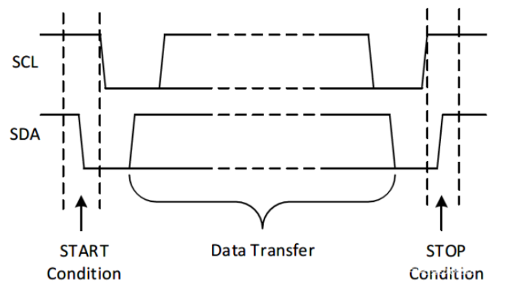
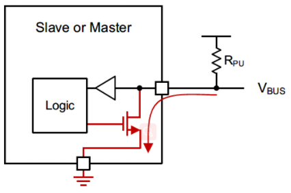

<h1 align="center"> Simulate I2C bus </h1>

---------------------
这是一个通过GPIO模拟I2C总线的库，采用依赖注入的设计方式，来适配不同MCU的GPIO操作。


# 1. API接口

| API                    | 说明                                        |
| -----------------      | ----------                                  |
| SimulateI2cInit        | I2C初始化                                   |
| SimulateI2cWrite       | 往I2C从机写指定长度数据                     |
| SimulateI2cRead        | 从I2C从机读指定长度数据                     |
| SimulateI2cWriteAndRead| 往I2C从机写指定长度后，再读取指定长度数据   |


## 1.1. SimulateI2cInit
初始化前，要先定义simulate_i2c_t这个数据结构，并实现里面的接口。

```c
typedef struct {
    i2c_delay_func_t    delay;
    i2c_scl_out_func_t  scl_out;
    i2c_sda_dir_func_t  sda_dir;
    i2c_sda_out_func_t  sda_out;
    i2c_sda_in_func_t   sda_in;
} simulate_i2c_t;
```

例:

```c

static void _i2c_delay(void)
{
    uint32_t i = 50;
	while (i > 0)
		i--;
}

static void _i2c_scl_out(uint8_t value)
{
    GPIO_write(GPIO_SCL, value);
}

static void _i2c_sda_dir(uint8_t value)
{
    if (value) {
        GPIO_setConfig(GPIO_SDA, OUT);
    } else {
        GPIO_setConfig(GPIO_SDA, IN);
    }
}

static void _i2c_sda_out(uint8_t value)
{
    GPIO_write(GPIO_SDA, value);
}

static uint8_t _i2c_sda_in(void)
{
    return GPIO_read(GPIO_SDA);
}

	// 初始化
	static simulate_i2c_t i2c;

    i2c.delay   = _i2c_delay;
    i2c.scl_out = _i2c_scl_out;
    i2c.sda_dir = _i2c_sda_dir;
    i2c.sda_out = _i2c_sda_out;
    i2c.sda_in  = _i2c_sda_in;

    simulate_i2c_init(&sg_i2c[0].i2c);

```

# 2. 移植应用

* 拷贝simulate_i2c文件夹到自己的工程源文件目录下
* IDE或者makefile文件中添加simulate_i2c.c源文件，添加simulate_i2c.h头文件文件路径
* 定义适配接口simulate_i2c_t，并实现相应的接口函数
* 调用SimulateI2cInit()初始化函数
* 调用I2C读写接口

# 3. IIC介绍

# 3.1 时序
**开始条件**：SCL high， SDA high-to-low 转换

**结束条件**：SCL high， SDA low-to-high 转换




开始条件发送之后，就可以传输数据了。

**传输时钟SCL high期间，数据线SDA必须保持稳定**

**在SCL low 期间，数据SDA才能改变。**

# 3.2 SDA/SCL引脚配置

IIC总线SDA、SCL外部需要上拉电阻，并且设置为开漏模式。



# 3.3 SDA方向配置

SDA工作中，有时处于输出，有时处于输入，因此需要频繁的切换GPIO输入/输出方向，
**有一种办法可以配置引脚，在输出模式下，可作为输入：配置成开漏输出，外加上拉电阻。**（部分芯片，如STM32系列是支持这种特性）

Note: 有些MCU的GPIO设置为开漏输出时，读取的GPIO不是实际电平，而是和输出值一致，因此需要来回配置输入/输出。（如部分的TI芯片）


3.3 模拟IIC时序

在read过程中，需要把SDA切换为输入、接收完1byte，要再切换为输出，然后发送ACK。

**这里需要注意：切换SDA方向前，要先把SCL拉低，否则从机会误识别到“开始信号”，最终导致获取数据异常。**

原因是：GPIO配置为输出时，可能会有电平变化(实测TI的部分MCU有这种现象)。

